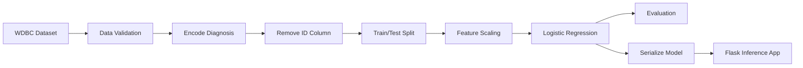

<div align="center">


# Vardaan — Breast Tumor Classification Web App

**An end-to-end machine-learning web application that classifies breast tumor samples as benign or malignant from 30 numerical features.**

[](https://www.python.org/)
[](https://flask.palletsprojects.com/)
[](https://scikit-learn.org/)
[](LICENSE)

</div>

---

## Overview

Vardaan is a Flask-based machine-learning application built around the **Wisconsin Diagnostic Breast Cancer dataset**. The application accepts 30 tumor measurements, sends them to a trained Logistic Regression model, and displays a binary classification:

- **Benign — non-cancerous**
- **Malignant — cancerous**

The repository also contains educational pages about breast cancer awareness, prevention and precautions, a feedback form backed by SQLite, an optional informational chatbot, the original model-development notebook, and the serialized model used by the application.

> **Medical disclaimer:** This project is an educational machine-learning demonstration. It is not a medical device and must not be used for diagnosis, treatment decisions, or replacing consultation with a qualified healthcare professional.

## Project Highlights

| Item | Value |
|---|---|
| Problem type | Binary classification |
| Dataset | Wisconsin Diagnostic Breast Cancer |
| Records | 569 |
| Input features | 30 numerical measurements |
| Model | Logistic Regression |
| Train/test split | 80/20 |
| Training accuracy | 94.73% |
| Test accuracy | 92.98% |
| Backend | Flask |
| Feedback storage | SQLite |
| Deployment server | Gunicorn |

The reported accuracy values come from the committed notebook and its recorded outputs. They should be treated as development results from one train/test split, not as clinical performance claims.

## Features

- Interactive Flask web interface
- Classification from all 30 model features
- Benign/malignant result page
- Breast cancer awareness content
- Prevention and precaution pages
- Feedback collection using SQLite
- Optional OpenAI-powered informational chatbot
- Reproducible training script
- Health-check endpoint for deployment monitoring
- Automated smoke tests with pytest
- GitHub Actions continuous integration
- Deployment-ready Gunicorn configuration

## Dataset

This project uses the **Breast Cancer Wisconsin (Diagnostic)** dataset.

The 30 input variables are calculated from digitized images of a fine-needle aspirate of a breast mass. They describe characteristics of cell nuclei using ten base measurements:

1. Radius
2. Texture
3. Perimeter
4. Area
5. Smoothness
6. Compactness
7. Concavity
8. Concave points
9. Symmetry
10. Fractal dimension

For each measurement, the dataset provides the **mean**, **standard error**, and **worst/largest** value, producing 30 input features.

Dataset reference: [UCI Machine Learning Repository](https://archive.ics.uci.edu/dataset/17/breast+cancer+wisconsin+diagnostic)

## Machine-Learning Workflow



The original notebook trains Logistic Regression directly on the features. The included `src/train_model.py` improves reproducibility by using a `StandardScaler` and Logistic Regression inside one scikit-learn pipeline.

## Repository Structure

```text
Final-BCD-2025/
├── .github/
│   └── workflows/
│       └── ci.yml
├── data/
│   └── breast-cancer.csv.xls
├── docs/
│   ├── MODEL_CARD.md
│   └── REPOSITORY_UPGRADE_GUIDE.md
├── notebooks/
│   └── Breast_cancer_Classification_using_ML.ipynb
├── src/
│   ├── __init__.py
│   └── train_model.py
├── static/
│   ├── assets/
│   └── style.css
├── templates/
│   ├── about.html
│   ├── chatbot.html
│   ├── check_risk.html
│   ├── contact.html
│   ├── feedback.html
│   ├── index.html
│   ├── precautions.html
│   ├── prevention.html
│   ├── result.html
│   └── thank_you.html
├── tests/
│   └── test_app.py
├── .env.example
├── .gitignore
├── app.py
├── chatbot.py
├── Breast_cancer_model.pkl
├── CONTRIBUTING.md
├── LICENSE
├── Procfile
├── pyproject.toml
├── requirements-dev.txt
└── requirements.txt
```

## Local Setup

### 1. Clone the repository

```bash
git clone https://github.com/sahilsharma20/Final-BCD-2025.git
cd Final-BCD-2025
```

### 2. Create a virtual environment

```bash
python3 -m venv .venv
source .venv/bin/activate
```

On Windows:

```powershell
python -m venv .venv
.venv\Scripts\activate
```

### 3. Install dependencies

```bash
python -m pip install --upgrade pip
pip install -r requirements.txt
```

For testing and development:

```bash
pip install -r requirements-dev.txt
```

### 4. Configure environment variables

```bash
cp .env.example .env
```

The prediction application works without an OpenAI key. The key and model name are required only for the optional chatbot.

### 5. Run the application

```bash
python app.py
```

Open:

```text
http://127.0.0.1:5000
```

## Retrain the Model

The training script uses the dataset already stored in the repository:

```bash
python -m src.train_model
```

It performs the following steps:

- Loads `data/breast-cancer.csv.xls`
- Validates required columns
- Maps `M` to `1` and `B` to `0`
- Removes the identifier column
- Creates a stratified 80/20 split
- Trains a scaling and Logistic Regression pipeline
- Prints accuracy and a classification report
- Saves the fitted pipeline to `Breast_cancer_model.pkl`

Retraining replaces the model used by the Flask app. Commit the new model only after reviewing the evaluation output.

## Run Tests

```bash
pytest
```

The smoke-test suite checks:

- Home page availability
- Health endpoint
- Successful benign prediction
- Successful malignant prediction
- Validation when a required feature is missing

## Application Routes

| Route | Method | Purpose |
|---|---|---|
| `/` | GET | Landing page |
| `/about` | GET | Breast cancer information |
| `/prevention` | GET | Prevention information |
| `/precautions` | GET | Precaution information |
| `/check_risk` | GET | Feature input form |
| `/predict` | POST | Model inference |
| `/chatbot` | GET | Chat interface |
| `/chatbot_response` | POST | Optional chatbot response |
| `/feedback` | GET, POST | Feedback form and storage |
| `/thank_you` | GET | Feedback confirmation |
| `/health` | GET | Deployment health check |

## Production Run

```bash
gunicorn app:app
```

The included `Procfile` uses the same command:

```text
web: gunicorn app:app
```

For production deployments, keep `FLASK_DEBUG=0`, store secrets in the hosting platform’s environment settings, and use persistent storage if feedback records must survive redeployments.

## Model Limitations

- Results are based on a relatively small dataset.
- The committed notebook records only accuracy, not recall, precision, F1 score, ROC-AUC, confidence intervals, or calibration.
- The recorded evaluation uses one train/test split.
- The original notebook produced a convergence warning because unscaled features were used with the default iteration limit.
- No external clinical validation has been performed.
- The app expects measurements produced from breast-mass image analysis; it is not a general symptom-based risk calculator.
- Predictions must not be interpreted as medical advice.

See [`docs/MODEL_CARD.md`](docs/MODEL_CARD.md) for additional details.

## Roadmap

- Add cross-validation and confidence intervals
- Report recall, precision, F1 score, ROC-AUC, and confusion matrix
- Add probability output with calibration analysis
- Add schema-based form validation
- Add model and data version tracking
- Add Docker support
- Add an accessible responsive base template
- Add end-to-end browser testing
- Deploy a public demonstration with persistent feedback storage

## Author

**Sahil Sharma**

- GitHub: [@sahilsharma20](https://github.com/sahilsharma20)
- Email: [sahilsharma68018@gmail.com](mailto:sahilsharma68018@gmail.com)

## License

This project is licensed under the [MIT License](LICENSE).
